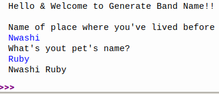

# Day1

## Lessons learned today

- Printing to the console
```
print("Hello World")
```
- Commenting code
```
# I am a comment
```
- Debugging
- String Manipulation

- Variables
```
name = 'Kingdreamerr'
# or
name = "kingdreamerr" 
```

## Project to solidify material learned 

### Band Name Generator:
> This is a program that takes in two pieces of input from the user and then concatenates the two to form one out put

#### Preview:

